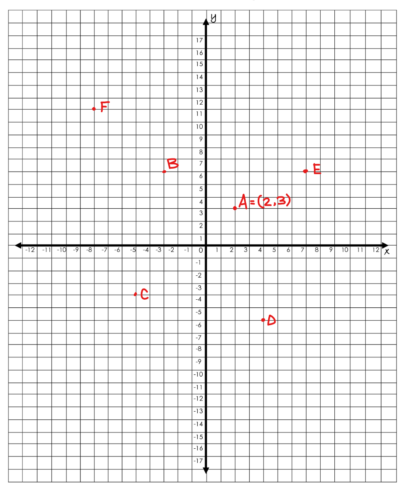
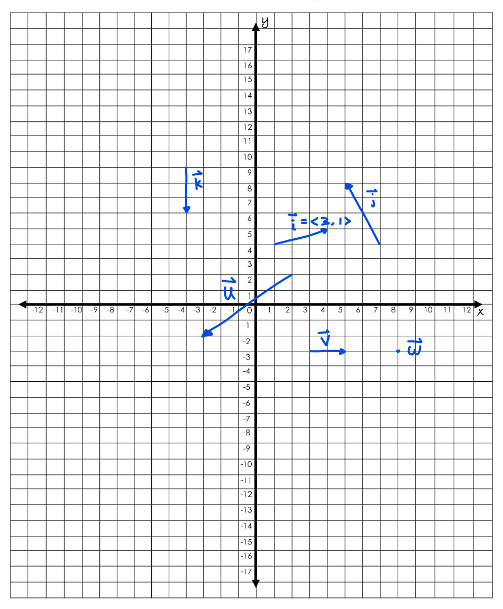

# Homework 8

1. Write down the coordinates for the points B, C, D, E, and F shown below. The
coordinates for A have been provided as an example.

2. Write down the coordinates for the vectors j, k, u, v, and w shown below. The
coordinates for i have been provided as an example.

